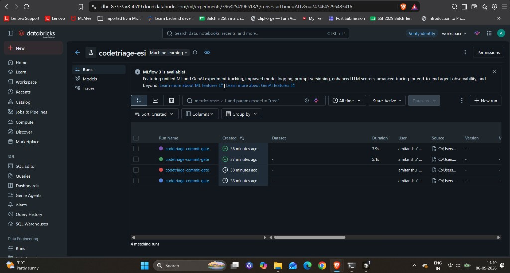
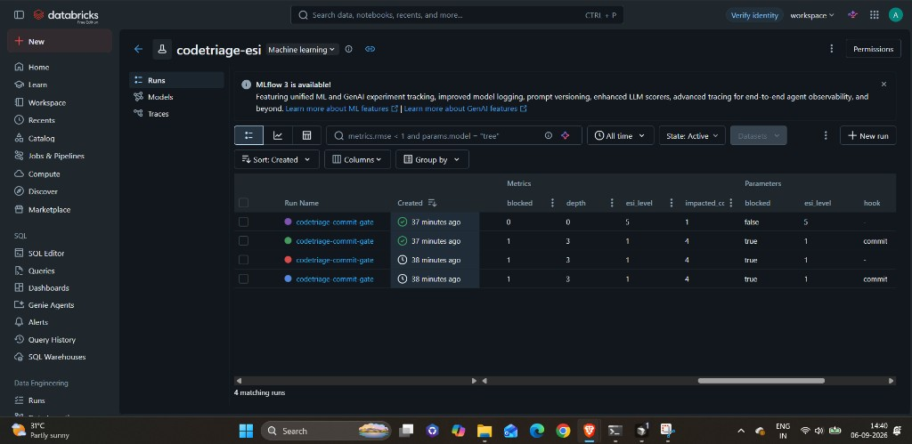
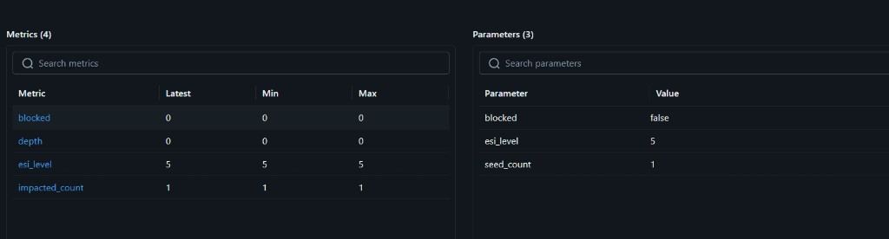
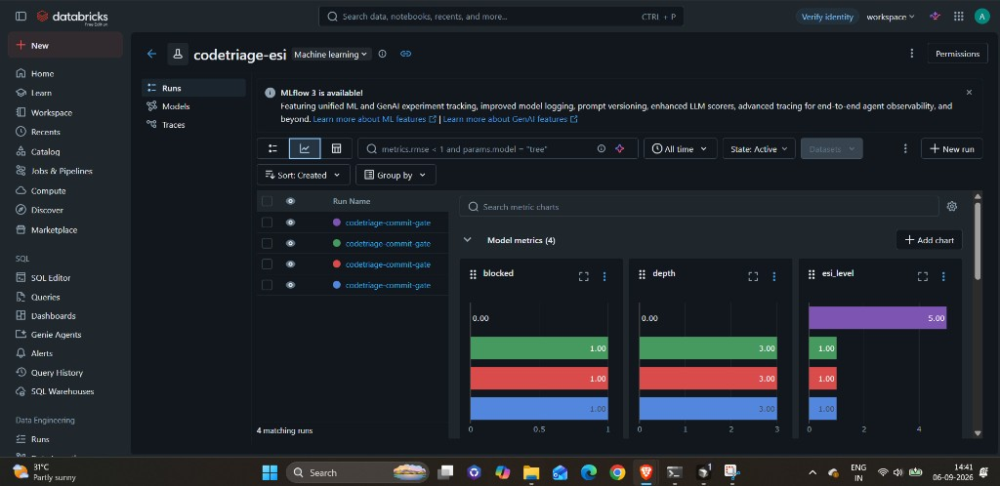
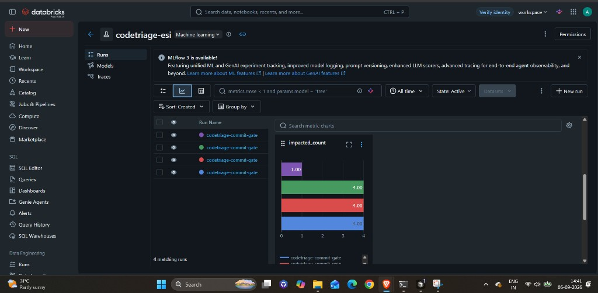
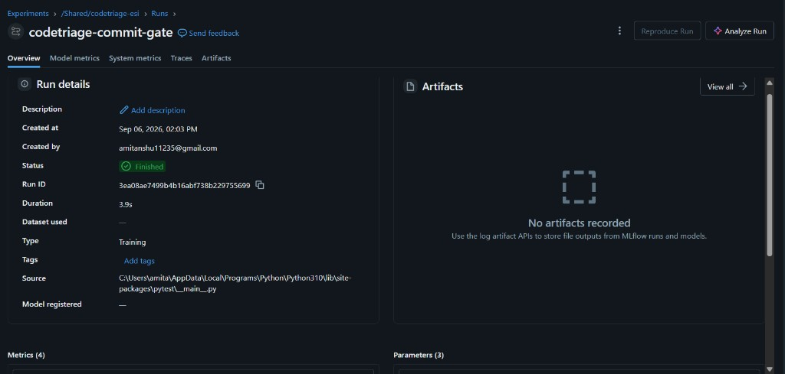

# CodeTriage

| Field | URL |
| --- | --- |
| **Entire** | https://entire.io/gh/HotaroOreki-art/CodeTriage |
| **GitHub branch** | https://github.com/HotaroOreki-art/CodeTriage/tree/CodeTriage |
| **Databricks experiment** | https://dbc-8e7e7ac8-4519.cloud.databricks.com/ml/experiments/396325419651879 |
| **Latest MLflow run** | https://dbc-8e7e7ac8-4519.cloud.databricks.com/ml/experiments/396325419651879/runs/3ea08ae7499b4b16abf738b229755699 |

## One-sentence summary
CodeTriage is an Entire-integrated pre-commit gatekeeper that calculates graph-based blast radius to automatically block dangerous, high-impact AI refactors before they are committed.

## Problem, intended user and why it matters
AI coding agents can autonomously make cascading changes that break critical dependencies. A one-line edit in a shared module can fan out through reverse dependents that no single diff makes obvious. For staff engineers and DevOps teams, CodeTriage is a deterministic safety net: if an agent’s commit has a dangerous blast radius, Entire must refuse it before the change lands.

## Selected Entire track and why Entire is essential
Track 3 (custom Entire external agent / graph-aware tooling). The Entire external-agent protocol (`start`, `stop`, `commit`) is essential because it intercepts the AI lifecycle at the commit-intent phase. Entire invokes `entire-agent-codetriage parse-hook --hook commit`, we parse the session transcript (Entire JSON or AcmeCode JSONL), seed a reverse-dependency BFS, and return a first-class protocol rejection (`metadata.decision=block`, exit 1) instead of an out-of-band script.

## Architecture and main workflow
Python CLI binary `entire-agent-codetriage` under `agents/entire-agent-codetriage/`.

```
AI agent write/edit/commit
        │
        ▼
Entire CLI  ── parse-hook --hook commit ──►  entire-agent-codetriage
                                               │
                                               ├─ unified transcript adapter (Entire JSON + AcmeCode JSONL)
                                               ├─ identify_modified_files
                                               ├─ reverse-dependency BFS (blast_radius.py)
                                               ├─ ESI classification
                                               ├─ Databricks MLflow telemetry (optional)
                                               └─ allow or reject (protocol + native Git hook)
```

- **Parser:** `transcript.py` normalizes both formats into `modified_files` / `session_id`.
- **ESI:** Level 1 (CRITICAL) when **depth ≥ 3** or **impacted files ≥ 10**.
- **Block:** stdout Event with `metadata.decision=block` and `response_message`; non-zero exit so Entire rejects the commit.
- **Native Git hook:** `install-hooks` writes **`.git/hooks/pre-commit`** (not `pre-commit-codetriage`) so Git actually fires the gate.

## Entire Graph findings and verification
Before any curveball code, we ran Entire Graph impact analysis on the parser and lifecycle surface (`entire graph search` then `entire graph impact --repo . --symbol identify_modified_files` / `parse_hook` / `write_session` / `evaluate_commit` / `_write_git_commit_hook`).

Finding: transcript parsing was tightly coupled to a single Entire JSON object. Callers of `identify_modified_files` feed `evaluate_commit` → `parse_hook` → `_cmd_parse_hook`. Checkpoint writers (`write_session`, `chunk_transcript`) and ESI math (`compute_blast_radius` / `classify_esi`) were **not** on the change list.

We adapted only the parser seam with a unified adapter. `blast_radius.py` was not edited. Verification: `pytest` — 26 passed, including original Entire JSON, AcmeCode JSONL `file_changed` events, unknown events, truncated JSONL, ESI Level 1 on JSONL seeds, and install-to-`.git/hooks/pre-commit`.

## Noon Curveball: what changed and how we adapted
**Invalidated assumption:** the agent would only ever send standard Entire lifecycle JSON.

**What arrived:** a heterogeneous AcmeCode JSONL transcript (one JSON object per line) plus the original format.

**Adaptation:**
- Unified adapter in `transcript.py` used by `parse_hook` and `identify_modified_files`.
- Extract paths from `file_changed` events; do not fork ESI or checkpoint writers.
- Unknown JSON events and non-objects are skipped without crashing.
- Truncated/incomplete JSONL keeps valid lines and returns a partial Event instead of discarding the session.
- Git hook install path fixed to `.git/hooks/pre-commit`.

## Checkpoint links and what each checkpoint proves
Entire dashboard opens from a commit URL: `https://entire.io/gh/<org>/<repo>/commit/<sha>` ([review in Entire.io](https://docs.entire.io/guides/checkpoints/review-in-entire-io)).

* **Pre-Noon Checkpoint** `4c368a9084a0` on commit [`2fa8b976dbb3bd797e72d2e3a449f1db8196284f`](https://entire.io/gh/HotaroOreki-art/CodeTriage/commit/2fa8b976dbb3bd797e72d2e3a449f1db8196284f) — proves ESI BFS and Level 1 gating existed before the curveball. Write-up: [`docs/checkpoints/checkpoint_1.md`](docs/checkpoints/checkpoint_1.md). Git: `4ddeb66` (pre-noon agent) then `2fa8b97` (hooks so checkpoints sync).
* **Final Curveball Checkpoint** `c9d4534d5d2d` on commit [`2e543a6317ceb07fa02f4a472b7225316ba0c9ac`](https://entire.io/gh/HotaroOreki-art/CodeTriage/commit/2e543a6317ceb07fa02f4a472b7225316ba0c9ac) — proves JSONL dual-format parsing, truncated-transcript resilience, `.git/hooks/pre-commit` install, and Windows MLflow encoding fix. Write-up: [`docs/checkpoints/checkpoint_final_curveball.md`](docs/checkpoints/checkpoint_final_curveball.md).

Repo dashboard: [https://entire.io/gh/HotaroOreki-art/CodeTriage](https://entire.io/gh/HotaroOreki-art/CodeTriage)

## Setup, run and test instructions
Requires Python 3.10+ and the Entire CLI on `PATH` for live graph/lifecycle checks.

```bash
cd agents/entire-agent-codetriage
python -m pip install -r requirements.txt
python -m pytest -q          # 26 tests; no Databricks required
# optional:
mise run build && mise run test
# optional protocol suite:
external-agents-tests verify ./entire-agent-codetriage
```

Enable in a repo (binary on `PATH`, `external_agents: true` in untracked `.entire/settings.local.json`):

```bash
entire enable --agent codetriage --telemetry=false
entire-agent-codetriage install-hooks
# confirms .git/hooks/pre-commit calls:
#   exec entire-agent-codetriage parse-hook --hook commit
```

Manually trigger the gate (ESI Level 1 rejection):

```bash
# fixture graph with a 3-hop reverse chain
printf '%s\n' '{"reverse_dependencies":{"core.py":["a.py"],"a.py":["b.py"],"b.py":["c.py"]}}' > .codetriage/graph.json
echo '{"session_id":"demo","modified_files":["core.py"]}' | entire-agent-codetriage parse-hook --hook commit
# expect exit 1, metadata.decision=block, "ESI Level 1"
```

Telemetry: copy `agents/entire-agent-codetriage/.env.example` to `.env` and set `DATABRICKS_HOST`, `DATABRICKS_TOKEN`, `MLFLOW_TRACKING_URI=databricks`. **If `.env` is missing, telemetry is skipped and the gate still runs (offline/CI default).** Never commit `.env`.

## Databricks use, data sources and limitations
Opting in for Best Use of Databricks. `telemetry.py` uses the official MLflow SDK against Databricks tracking. Each commit evaluation logs:

| Field | Kind |
| --- | --- |
| `esi_level` | param + metric |
| `impacted_count` | metric |
| `depth` | metric |
| `blocked` | param + metric |

**Data source:** CodeTriage ESI results only (no production user data). Experiment: `/Shared/codetriage-esi` (`396325419651879`) in workspace `https://dbc-8e7e7ac8-4519.cloud.databricks.com`. Latest finished run: [`3ea08ae7499b4b16abf738b229755699`](https://dbc-8e7e7ac8-4519.cloud.databricks.com/ml/experiments/396325419651879/runs/3ea08ae7499b4b16abf738b229755699) (`codetriage-commit-gate`, 3.9s, 4 metrics / 3 parameters).

**Limits:** Fails open for telemetry — a Databricks outage, Free Edition quota, or missing credentials **does not block** the commit gate. Secrets stay in gitignored `.env`; this repository contains **no** `dapi` tokens.

### Verification Evidence & Telemetry Snapshots

The accompanying screenshots verify end-to-end execution, graph analysis, and Databricks telemetry tracking across the evaluation lifecycle:

* **Workspace & Experiment Setup:** Shows the active `/Shared/codetriage-esi` MLflow experiment configured inside the Databricks Free Edition workspace, demonstrating secure authentication without leaked credentials.

  

* **Blast Radius Metrics & Run Parameters:** Captures the live decision payload for evaluated commits, verifying parameter logging for `esi_level = 1`, reverse-dependency traversal `depth = 3`, and the active `blocked = true` intervention.

  

  

* **Comparative Run History:** Displays consecutive `codetriage-commit-gate` lifecycle runs across multiple commits, demonstrating consistent latency, repeatability, and status tracking.

  

* **Graph Dependency Traversal:** Visualizes the BFS dependency blast radius and edge counts evaluated prior to commit approval or rejection (`depth` and `impacted_count` logged from `blast_radius.py`).

  

* **Curveball Adaptation Runs:** Proves parsing and metric extraction remained stable across both standard Entire payloads and streaming AcmeCode JSONL sessions (allow path `esi_level = 5` / `blocked = 0` vs Level 1 block `esi_level = 1` / `depth = 3`).

* **Pre-Commit Gate Interception:** Confirms native `.git/hooks/pre-commit` execution where high-risk changes were successfully halted before code merged into the tree (blocked runs in the history above).

  

## Known limitations and next steps
Currently file-level reverse BFS, not symbol-level AST resolution. Empty Git-hook stdin still maps to protocol `null` (Entire supplies the payload when it invokes `parse-hook`). Next toward production: symbol-level dependents, and a Slack (or similar) human-in-the-loop override when ESI Level 1 fires.
